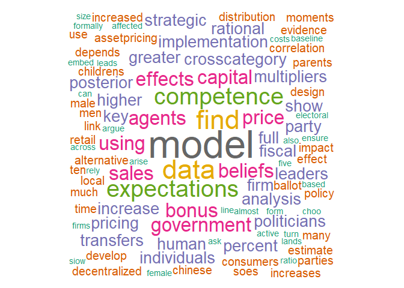
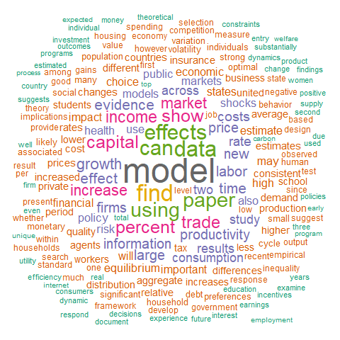
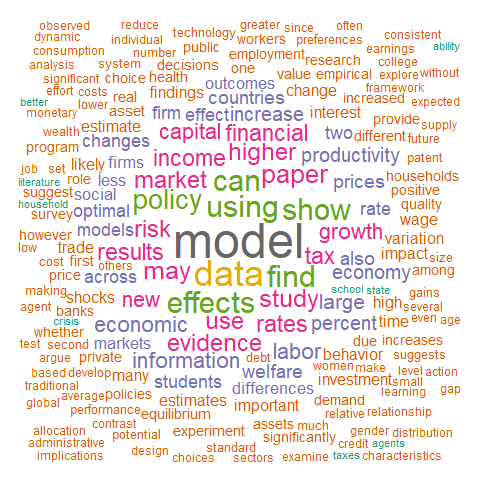
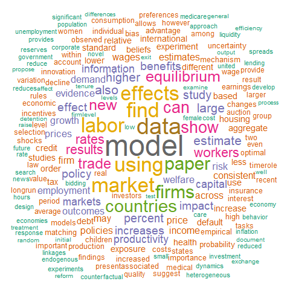

*DISCLAIMER: Do not exploit the instruction below to hammer the AEA website; MIT license applies.*

Learning goals:

-   understand basics of HTML and analyze websites
-   exploit HTML structures to grab data
-   extract abstracts of journal articles from AER

A website for an article usually looks like this:

<https://www.aeaweb.org/articles?id=10.1257/aer.20150154>

To access a journal article with URL, you need DOI and AER identifier. For instance, the URL for the article above should be accessed with DOI `10.1257` and AER identifier `20150154`. Good news is that you can find all article links (in theory) from a webpage for each *issue*:

AEA journal website is located at

<https://www.aeaweb.org/journals/>

Go to AER, then you will find

<https://www.aeaweb.org/journals/aer/issues>

Click on one issue, you will find all articles contained in each issue!

Text mining with `rvest`
========================

Extracting all issues
---------------------

AER website is well-made -- using developer tools from a web browser, one can see that all articles are all contained in classes whose names begin with `journal-preview`.

Also, using `SelectorGadget`, one can easily find that all journal issues are contained in nodes with `a`. Let's extract all the HTML nodes with `a` (which is, in fact, the name of nodes being used for links in all websites):

``` r
issues.root.html <- read_html("https://www.aeaweb.org/journals/aer/issues")
issue.urls <- issues.root.html %>%
  html_nodes(".journal-preview") %>% # . indicates a class name
  html_nodes("a") # all links
print(issue.urls)
```

    ## {xml_nodeset (139)}
    ##  [1] <a href="/issues/526">November 2018 (Vol. 108, No.11 )</a>
    ##  [2] <a href="/issues/523">October 2018 (Vol. 108, No.10 )</a>
    ##  [3] <a href="/issues/519">September 2018 (Vol. 108, No.9 )</a>
    ##  [4] <a href="/issues/517">August 2018 (Vol. 108, No.8 )</a>
    ##  [5] <a href="/issues/513">July 2018 (Vol. 108, No.7 )</a>
    ##  [6] <a href="/issues/510">June 2018 (Vol. 108, No.6 )</a>
    ##  [7] <a href="/issues/503">April 2018 (Vol. 108, No.4-5 )</a>
    ##  [8] <a href="/issues/498">March 2018 (Vol. 108, No.3 )</a>
    ##  [9] <a href="/issues/494">February 2018 (Vol. 108, No.2 )</a>
    ## [10] <a href="/issues/491">January 2018 (Vol. 108, No.1 )</a>
    ## [11] <a href="/issues/489">December 2017 (Vol. 107, No.12 )</a>
    ## [12] <a href="/issues/486">November 2017 (Vol. 107, No.11 )</a>
    ## [13] <a href="/issues/483">October 2017 (Vol. 107, No.10 )</a>
    ## [14] <a href="/issues/477">September 2017 (Vol. 107, No.9 )</a>
    ## [15] <a href="/issues/475">August 2017 (Vol. 107, No.8 )</a>
    ## [16] <a href="/issues/472">July 2017 (Vol. 107, No.7 )</a>
    ## [17] <a href="/issues/466">June 2017 (Vol. 107, No.6 )</a>
    ## [18] <a href="/issues/465">May 2017 (Vol. 107, No.5 )</a>
    ## [19] <a href="/issues/449">April 2017 (Vol. 107, No.4 )</a>
    ## [20] <a href="/issues/446">March 2017 (Vol. 107, No.3 )</a>
    ## ...

### Extracting URLs

To grab URLs, run the followings:

``` r
issue.urls <- issues.root.html %>%
  html_nodes(".journal-preview") %>% # . indicates a class name
  html_nodes("a") %>% # all links
  html_attr("href") %>% # extract the links specified by `href`
  as_data_frame() %>% # convert the links to a data frame object for filtering
print(issue.urls$value) # since issue.urls is a data.frame, need to extract $value
```

    ## # A tibble: 139 x 1
    ##    value      
    ##    <chr>      
    ##  1 /issues/526
    ##  2 /issues/523
    ##  3 /issues/519
    ##  4 /issues/517
    ##  5 /issues/513
    ##  6 /issues/510
    ##  7 /issues/503
    ##  8 /issues/498
    ##  9 /issues/494
    ## 10 /issues/491
    ## # ... with 129 more rows

but note that they are all *relative* (to the AER website home) URLs. Thus, to get the correct URLs, `https://www.aeaweb.org/` has to be appended in front. In R this can be done by using `paste0`, which can be used for vectorized strings too.

``` r
issue.urls <- paste0("https://www.aeaweb.org", issue.urls$value)
print(head(issue.urls))
```

    ## [1] "https://www.aeaweb.org/issues/526" "https://www.aeaweb.org/issues/523"
    ## [3] "https://www.aeaweb.org/issues/519" "https://www.aeaweb.org/issues/517"
    ## [5] "https://www.aeaweb.org/issues/513" "https://www.aeaweb.org/issues/510"

### Extracting years of publication

We need years of publications for word clouds too. Note that the texts for the links all contain years of publication too! To grab the texts for the links, run the followings:

``` r
issue.years <- issues.root.html %>%
  html_nodes(".journal-preview") %>% # . indicates a class name
  html_nodes("a") %>% # all links
  html_text %>% # extract the links specified by `href`
  as_data_frame() %>% # convert the links to a data frame object for filtering
print(issue.years$value)
```

    ## # A tibble: 139 x 1
    ##    value                           
    ##    <chr>                           
    ##  1 November 2018 (Vol. 108, No.11 )
    ##  2 October 2018 (Vol. 108, No.10 ) 
    ##  3 September 2018 (Vol. 108, No.9 )
    ##  4 August 2018 (Vol. 108, No.8 )   
    ##  5 July 2018 (Vol. 108, No.7 )     
    ##  6 June 2018 (Vol. 108, No.6 )     
    ##  7 April 2018 (Vol. 108, No.4-5 )  
    ##  8 March 2018 (Vol. 108, No.3 )    
    ##  9 February 2018 (Vol. 108, No.2 ) 
    ## 10 January 2018 (Vol. 108, No.1 )  
    ## # ... with 129 more rows

To parse the year, note that all years are the second words of each text:

``` r
issue.years <- word(issue.years$value, start = 2, end = 2) # extract the second words
```

Combining `issue.urls` and `issue.years`, we can construct the following `data.frame` called `issue.df` that contains all AER issues available in AEA website and their corresponding years of publication:

``` r
issue.df <- data.frame(issue = issue.urls, year = issue.years)
print(head(issue.df))
```

    ##                               issue year
    ## 1 https://www.aeaweb.org/issues/526 2018
    ## 2 https://www.aeaweb.org/issues/523 2018
    ## 3 https://www.aeaweb.org/issues/519 2018
    ## 4 https://www.aeaweb.org/issues/517 2018
    ## 5 https://www.aeaweb.org/issues/513 2018
    ## 6 https://www.aeaweb.org/issues/510 2018

Extracting article names and URLs from a single issue
-----------------------------------------------------

The following script extracts the HTML of the journal issue with `ISSUE.NUMBER = 475`:

``` r
issue.html <- read_html("https://www.aeaweb.org/issues/475")
```

It's time to use SelectorGadget (<https://selectorgadget.com/>) to figure out how each webpage was constructed. It is not difficult to see that - node with `section h1` contains the title of the journal (`American Economic Review`) - node with `section h2` contains the volume number and date of publication (`Vol. 107 No. 8 August 2017`) - nodes with `h3 a` contains the titles of all articles appeared in the issue (`Front Matter`, `Partner Choice, Investment in Children, and the Marital College Premium`, ...)

### Journal name

To extract the journal name,

``` r
journal.name <- issue.html %>% 
  html_nodes("section h1") %>% # access the html node with `section h1`
  html_text() # filter the html data so that we have only string data

print(journal.name)
```

    ## [1] "American Economic Review"

### Year of publication

Similarly, we can extract the year of publication.

``` r
year.of.pub <- issue.html %>% 
  html_nodes("section h2") %>% # access the html node with `section h2`
  html_text() # filter the html data so that we have only string data

print(year.of.pub) # this line contains volume #/month/year. Extract the very last word for year!
```

    ## [1] "\n            Vol. 107            No. 8             August 2017        "

Note that the text we extracted contains volume number AND month of publication AND year of publication. We can use `stringr` to extract the very last word, which is the year of publication.

``` r
year.of.pub <- stri_extract_last_words(year.of.pub) # extract the last word
print(year.of.pub)
```

    ## [1] "2017"

### Article titles

Similarly, for article titles:

``` r
article.titles <- issue.html %>% 
  html_nodes("h3 a") %>% # access the html node with `h3 a`
  html_text() # filter the html data so that we have only string data

print(article.titles)
```

    ##  [1] "Front Matter"                                                                                                 
    ##  [2] "Partner Choice, Investment in Children, and the Marital College Premium"                                      
    ##  [3] "Team Incentives and Performance: Evidence from a Retail Chain"                                                
    ##  [4] "Gender Quotas and the Crisis of the Mediocre Man: Theory and Evidence from Sweden"                            
    ##  [5] "Full Implementation and Belief Restrictions"                                                                  
    ##  [6] "Identifying and Spurring High-Growth Entrepreneurship: Experimental Evidence from a Business Plan Competition"
    ##  [7] "Multi-category Competition and Market Power: A Model of Supermarket Pricing"                                  
    ##  [8] "Stock Price Booms and Expected Capital Gains"                                                                 
    ##  [9] "Clearing Up the Fiscal Multiplier Morass"                                                                     
    ## [10] "Hayek, Local Information, and Commanding Heights: Decentralizing State-Owned Enterprises in China"

### Article URLs

Now it's time to grab article URLs from each issue! To do so, simply change `html_text()` in piping to `html_attr("href")` since we are looking for the URL that each journal article links to.

``` r
article.urls <- issue.html %>% 
  html_nodes("h3 a") %>% # access the html node with `h3 a`
  html_attr("href") # access what the node links to

print(article.urls)
```

    ##  [1] "/articles?id=10.1257/aer.107.8.i" 
    ##  [2] "/articles?id=10.1257/aer.20150154"
    ##  [3] "/articles?id=10.1257/aer.20160788"
    ##  [4] "/articles?id=10.1257/aer.20160080"
    ##  [5] "/articles?id=10.1257/aer.20151462"
    ##  [6] "/articles?id=10.1257/aer.20151404"
    ##  [7] "/articles?id=10.1257/aer.20160055"
    ##  [8] "/articles?id=10.1257/aer.20140205"
    ##  [9] "/articles?id=10.1257/aer.20111196"
    ## [10] "/articles?id=10.1257/aer.20150592"

Note that the URLs we get are not the full URLs (which we need to get access to the HTML data), rather the URLs relative to the home website (`https://www.aeaweb.org/`). Hence, to get the complete URLs, we have to put `https://www.aeaweb.org` in front. To do so, use `paste0` in R. Note that `paste0` can be applied to vector too.

``` r
article.urls <- paste0("https://www.aeaweb.org", article.urls)
article.urls
```

    ##  [1] "https://www.aeaweb.org/articles?id=10.1257/aer.107.8.i" 
    ##  [2] "https://www.aeaweb.org/articles?id=10.1257/aer.20150154"
    ##  [3] "https://www.aeaweb.org/articles?id=10.1257/aer.20160788"
    ##  [4] "https://www.aeaweb.org/articles?id=10.1257/aer.20160080"
    ##  [5] "https://www.aeaweb.org/articles?id=10.1257/aer.20151462"
    ##  [6] "https://www.aeaweb.org/articles?id=10.1257/aer.20151404"
    ##  [7] "https://www.aeaweb.org/articles?id=10.1257/aer.20160055"
    ##  [8] "https://www.aeaweb.org/articles?id=10.1257/aer.20140205"
    ##  [9] "https://www.aeaweb.org/articles?id=10.1257/aer.20111196"
    ## [10] "https://www.aeaweb.org/articles?id=10.1257/aer.20150592"

### Extracting a single abstract

Let's read the abstract:

``` r
(read_html(article.urls[2]) %>%
  html_nodes("section section") %>%
  html_text())[3]
```

    ## [1] "Abstract\n\t\t\t\t\tWe construct a model of household decision-making in which agents consume a private and a public good, interpreted as children's welfare. Children's utility depends on their human capital, which depends on the time their parents spend with them and on the parents' human capital. We first show that as returns to human capital increase, couples at the top of the income distribution should spend more time with their children. This in turn should reinforce assortative matching, in a sense that we precisely define. We then embed the model into a transferable utility matching framework with random preferences, a la Choo and Siow (2006), which we estimate using US marriage data for individuals born between 1943 and 1972. We find that the preference for partners of the same education has significantly increased for white individuals, particularly for the highly educated. We find no evidence of such an increase for black individuals. Moreover, in line with theoretical predictions, we find that the \"marital college-plus premium\" has increased for women but not for men.\t\t\t\t"

Extracting multiple abstracts
-----------------------------

Note that we have a list of URLs to all AER issues (from March 1999)! -- hence we can get all abstracts by iterating over all issue URLs.

To do so, construct a function that returns the abstract article given an article URL.

``` r
GetAbstract <- function (article.url) {
  (read_html(article.url) %>%
    html_nodes("section section") %>%
    html_text())[3]
}
```

Second, construct a function that returns the URLs of articles given an issue URL.

``` r
GetArticleURLs <- function (issue.url) {
  issue.html <- read_html(issue.url)
  article.urls <- issue.html %>% 
    html_nodes("h3 a") %>% # access the html node with `h3 a`
    html_attr("href") # access what the node links to
  paste0("https://www.aeaweb.org", article.urls) # transform relative urls
}
```

The abstracts of all articles contained in the issue with the URL `https://www.aeaweb.org/issues/475` can be extracted by `sapply`ing `GetAbstract` over the article URLs obtained by `GetArticleURLs("https://www.aeaweb.org/issues/475")`, which will return a vector of abstracts:

``` r
abstracts <- sapply(GetArticleURLs("https://www.aeaweb.org/issues/475"), GetAbstract)
abstracts <- abstracts[2:length(abstracts)] # the first abstract is empty (Front Matter)
print(abstracts[1])
```

    ##                                                                                                                                                                                                                                                                                                                                                                                                                                                                                                                                                                                                                                                                                                                                                                                                                                                                                                                                                                                                                                                                                    https://www.aeaweb.org/articles?id=10.1257/aer.20150154 
    ## "Abstract\n\t\t\t\t\tWe construct a model of household decision-making in which agents consume a private and a public good, interpreted as children's welfare. Children's utility depends on their human capital, which depends on the time their parents spend with them and on the parents' human capital. We first show that as returns to human capital increase, couples at the top of the income distribution should spend more time with their children. This in turn should reinforce assortative matching, in a sense that we precisely define. We then embed the model into a transferable utility matching framework with random preferences, a la Choo and Siow (2006), which we estimate using US marriage data for individuals born between 1943 and 1972. We find that the preference for partners of the same education has significantly increased for white individuals, particularly for the highly educated. We find no evidence of such an increase for black individuals. Moreover, in line with theoretical predictions, we find that the \"marital college-plus premium\" has increased for women but not for men.\t\t\t\t"

Drawing word clouds
-------------------

``` r
# install.packages("wordcloud") # uncomment and run this line if ggwordcloud is not installed
# install.packages("tm") # uncomment and run this line if tm is not installed
library(wordcloud)
```

    ## Warning: package 'wordcloud' was built under R version 3.5.1

    ## Loading required package: RColorBrewer

``` r
library(tm)
```

    ## Warning: package 'tm' was built under R version 3.5.1

    ## Loading required package: NLP

    ## Warning: package 'NLP' was built under R version 3.5.1

For text analysis, one can use the package called `tm` (named after **Text Mining**):

``` r
text <- toString(abstracts) # combine all abstracts together
docs <- Corpus(VectorSource(text)) # construct a Corpus object based on text
inspect(docs)
```

    ## <<SimpleCorpus>>
    ## Metadata:  corpus specific: 1, document level (indexed): 0
    ## Content:  documents: 1
    ## 
    ## [1] Abstract\n\t\t\t\t\tWe construct a model of household decision-making in which agents consume a private and a public good, interpreted as children's welfare. Children's utility depends on their human capital, which depends on the time their parents spend with them and on the parents' human capital. We first show that as returns to human capital increase, couples at the top of the income distribution should spend more time with their children. This in turn should reinforce assortative matching, in a sense that we precisely define. We then embed the model into a transferable utility matching framework with random preferences, a la Choo and Siow (2006), which we estimate using US marriage data for individuals born between 1943 and 1972. We find that the preference for partners of the same education has significantly increased for white individuals, particularly for the highly educated. We find no evidence of such an increase for black individuals. Moreover, in line with theoretical predictions, we find that the "marital college-plus premium" has increased for women but not for men.\t\t\t\t, Abstract\n\t\t\t\t\tIn a field experiment with a retail chain (1,300 employees, 193 shops), randomly selected sales teams received a bonus. The bonus increases both sales and number of customers dealt with by 3 percent. Each dollar spent on the bonus generates $3.80 in sales, and $2.10 in profit. Wages increase by 2.2 percent while inequality rises only moderately. The analysis suggests effort complementarities to be important, and the effectiveness of peer pressure in overcoming free-riding to be limited. After rolling out the bonus treatment, and control shops' performance converge, suggesting long-term stability of the treatment effect.\t\t\t\t, Abstract\n\t\t\t\t\tWe develop a model where party leaders choose the competence of politicians on the ballot to trade off electoral success against their own survival. The predicted correlation between the competence of party leaders and followers is strongly supported in Swedish data. We use a novel approach, based on register data for the earnings of the whole population, to measure the competence of all politicians in 7 parties, 290 municipalities, and 10 elections (for the period 1982-2014). We ask how competence was affected by a zipper quota, requiring local parties to alternate men and women on the ballot, implemented by the Social Democratic Party in 1993. Far from being at odds with meritocracy, this quota raised the competence of male politicians where it raised female representation the most. We argue that resignation of mediocre male leaders was a key driver of this effect.\t\t\t\t, Abstract\n\t\t\t\t\tMultiplicity of equilibria and the dependence on strong common knowledge assumptions are well-known problems in mechanism design. We address them by studying full implementation via transfer schemes, under general restrictions on agents' beliefs. We show that incentive-compatible transfers ensure uniqueness—and hence full implementation—if they induce sufficiently weak strategic externalities. We then design transfers for full implementation by using information on beliefs in order to weaken the strategic externalities of the baseline canonical transfers. Our results rely on minimal restrictions on agents' beliefs, specifically on moments of the distribution of types, that arise naturally in applications.\t\t\t\t, Abstract\n\t\t\t\t\tAlmost all firms in developing countries have fewer than ten workers, with a modal size of one. Are there potential high-growth entrepreneurs, and can public policy help identify them and facilitate their growth? A large-scale national business plan competition in Nigeria provides evidence on these questions. Random assignment of US$34 million in grants provided each winner with approximately US$50,000. Surveys tracking applicants over five years show that winning leads to greater firm entry, more survival, higher profits and sales, and higher employment, including increases of over 20 percentage points in the likelihood of a firm having ten or more workers.\t\t\t\t, Abstract\n\t\t\t\t\tIn many competitive settings, consumers buy multiple product categories, and some prefer to use a single firm, generating complementary cross-category price effects. To study pricing in supermarkets, an organizational form where these effects are internalized, we develop a multi-category, multi-seller demand model and estimate it using UK consumer data. This class of model is used widely in theoretical analysis of retail pricing. We quantify cross-category pricing effects and find that internalizing them substantially reduces market power. We find that consumers inclined to one-stop (rather than multi-stop) shopping have a greater pro-competitive impact because they generate relatively large cross-category effects.\t\t\t\t, Abstract\n\t\t\t\t\tInvestors' subjective capital gains expectations are a key element explaining stock price fluctuations. Survey measures of these expectations display excessive optimism (pessimism) at market peaks (troughs). We formally reject the hypothesis that this is compatible with rational expectations. We then incorporate subjective price beliefs with such properties into a standard asset-pricing model with rational agents (internal rationality). The model gives rise to boom-bust cycles that temporarily delink stock prices from fundamentals and quantitatively replicates many asset-pricing moments. In particular, it matches the observed strong positive correlation between the price dividend ratio and survey return expectations, which cannot be matched by rational expectations.\t\t\t\t, Abstract\n\t\t\t\t\tWe quantify government spending multipliers in US data using Bayesian prior and posterior analysis of a monetary model with fiscal details and two distinct monetary-fiscal policy regimes. The combination of model specification, observable data, and relatively diffuse priors for some parameters lands posterior estimates in regions of the parameter space that yield fresh perspectives on the transmission mechanisms that underlie government spending multipliers. Short-run output multipliers are comparable across regimes—posterior means around 1.3 on impact—but much larger after 10 years under passive money/active fiscal than under active money/passive fiscal—90 percent credible sets of [1.5, 1.9] versus [0.1, 0.4] in present value, when estimated from 1955 to 2016.\t\t\t\t, Abstract\n\t\t\t\t\tHayek (1945) argues that local information is key to understanding the efficiency of alternative economic systems and whether production should be centralized or decentralized. The Chinese experience of decentralizing SOEs confirms this insight: when the distance to the government is farther, the SOE is more likely to be decentralized, and this distance-decentralization link is more pronounced with higher communication costs and greater firm-performance heterogeneity. However, when the Chinese central government oversees SOEs in strategic industries, the distance-decentralization link is muted. We also consider alternative agency-cost-based explanations, and do not find much support.\t\t\t\t

Note that there are a number of words that we do not need for analysis, like `\t` (for tab), `\n` (for line change) and `Abstract` (title of each abstract):

``` r
toSpace <- content_transformer(function (x, pattern ) gsub(pattern, " ", x))
docs <- tm_map(docs, toSpace, "\t") # replace \t with space
```

    ## Warning in tm_map.SimpleCorpus(docs, toSpace, "\t"): transformation drops
    ## documents

``` r
docs <- tm_map(docs, toSpace, "\n") # replace \n with space
```

    ## Warning in tm_map.SimpleCorpus(docs, toSpace, "\n"): transformation drops
    ## documents

``` r
docs <- tm_map(docs, toSpace, "Abstract") # replace Abstract (title of each abstract) with space
```

    ## Warning in tm_map.SimpleCorpus(docs, toSpace, "Abstract"): transformation
    ## drops documents

``` r
inspect(docs)
```

    ## <<SimpleCorpus>>
    ## Metadata:  corpus specific: 1, document level (indexed): 0
    ## Content:  documents: 1
    ## 
    ## [1]        We construct a model of household decision-making in which agents consume a private and a public good, interpreted as children's welfare. Children's utility depends on their human capital, which depends on the time their parents spend with them and on the parents' human capital. We first show that as returns to human capital increase, couples at the top of the income distribution should spend more time with their children. This in turn should reinforce assortative matching, in a sense that we precisely define. We then embed the model into a transferable utility matching framework with random preferences, a la Choo and Siow (2006), which we estimate using US marriage data for individuals born between 1943 and 1972. We find that the preference for partners of the same education has significantly increased for white individuals, particularly for the highly educated. We find no evidence of such an increase for black individuals. Moreover, in line with theoretical predictions, we find that the "marital college-plus premium" has increased for women but not for men.    ,        In a field experiment with a retail chain (1,300 employees, 193 shops), randomly selected sales teams received a bonus. The bonus increases both sales and number of customers dealt with by 3 percent. Each dollar spent on the bonus generates $3.80 in sales, and $2.10 in profit. Wages increase by 2.2 percent while inequality rises only moderately. The analysis suggests effort complementarities to be important, and the effectiveness of peer pressure in overcoming free-riding to be limited. After rolling out the bonus treatment, and control shops' performance converge, suggesting long-term stability of the treatment effect.    ,        We develop a model where party leaders choose the competence of politicians on the ballot to trade off electoral success against their own survival. The predicted correlation between the competence of party leaders and followers is strongly supported in Swedish data. We use a novel approach, based on register data for the earnings of the whole population, to measure the competence of all politicians in 7 parties, 290 municipalities, and 10 elections (for the period 1982-2014). We ask how competence was affected by a zipper quota, requiring local parties to alternate men and women on the ballot, implemented by the Social Democratic Party in 1993. Far from being at odds with meritocracy, this quota raised the competence of male politicians where it raised female representation the most. We argue that resignation of mediocre male leaders was a key driver of this effect.    ,        Multiplicity of equilibria and the dependence on strong common knowledge assumptions are well-known problems in mechanism design. We address them by studying full implementation via transfer schemes, under general restrictions on agents' beliefs. We show that incentive-compatible transfers ensure uniqueness—and hence full implementation—if they induce sufficiently weak strategic externalities. We then design transfers for full implementation by using information on beliefs in order to weaken the strategic externalities of the baseline canonical transfers. Our results rely on minimal restrictions on agents' beliefs, specifically on moments of the distribution of types, that arise naturally in applications.    ,        Almost all firms in developing countries have fewer than ten workers, with a modal size of one. Are there potential high-growth entrepreneurs, and can public policy help identify them and facilitate their growth? A large-scale national business plan competition in Nigeria provides evidence on these questions. Random assignment of US$34 million in grants provided each winner with approximately US$50,000. Surveys tracking applicants over five years show that winning leads to greater firm entry, more survival, higher profits and sales, and higher employment, including increases of over 20 percentage points in the likelihood of a firm having ten or more workers.    ,        In many competitive settings, consumers buy multiple product categories, and some prefer to use a single firm, generating complementary cross-category price effects. To study pricing in supermarkets, an organizational form where these effects are internalized, we develop a multi-category, multi-seller demand model and estimate it using UK consumer data. This class of model is used widely in theoretical analysis of retail pricing. We quantify cross-category pricing effects and find that internalizing them substantially reduces market power. We find that consumers inclined to one-stop (rather than multi-stop) shopping have a greater pro-competitive impact because they generate relatively large cross-category effects.    ,        Investors' subjective capital gains expectations are a key element explaining stock price fluctuations. Survey measures of these expectations display excessive optimism (pessimism) at market peaks (troughs). We formally reject the hypothesis that this is compatible with rational expectations. We then incorporate subjective price beliefs with such properties into a standard asset-pricing model with rational agents (internal rationality). The model gives rise to boom-bust cycles that temporarily delink stock prices from fundamentals and quantitatively replicates many asset-pricing moments. In particular, it matches the observed strong positive correlation between the price dividend ratio and survey return expectations, which cannot be matched by rational expectations.    ,        We quantify government spending multipliers in US data using Bayesian prior and posterior analysis of a monetary model with fiscal details and two distinct monetary-fiscal policy regimes. The combination of model specification, observable data, and relatively diffuse priors for some parameters lands posterior estimates in regions of the parameter space that yield fresh perspectives on the transmission mechanisms that underlie government spending multipliers. Short-run output multipliers are comparable across regimes—posterior means around 1.3 on impact—but much larger after 10 years under passive money/active fiscal than under active money/passive fiscal—90 percent credible sets of [1.5, 1.9] versus [0.1, 0.4] in present value, when estimated from 1955 to 2016.    ,        Hayek (1945) argues that local information is key to understanding the efficiency of alternative economic systems and whether production should be centralized or decentralized. The Chinese experience of decentralizing SOEs confirms this insight: when the distance to the government is farther, the SOE is more likely to be decentralized, and this distance-decentralization link is more pronounced with higher communication costs and greater firm-performance heterogeneity. However, when the Chinese central government oversees SOEs in strategic industries, the distance-decentralization link is muted. We also consider alternative agency-cost-based explanations, and do not find much support.

Remove stop words (aka *filler words*), numbers, punctuations, and other special characters that can appear. Also, change all the words to lower case:

``` r
docs <- tm_map(docs, content_transformer(tolower)) # lower case
```

    ## Warning in tm_map.SimpleCorpus(docs, content_transformer(tolower)):
    ## transformation drops documents

``` r
docs <- tm_map(docs, removeWords, stopwords("en")) # remove stop words
```

    ## Warning in tm_map.SimpleCorpus(docs, removeWords, stopwords("en")):
    ## transformation drops documents

``` r
docs <- tm_map(docs, removePunctuation) # remove punctuations
```

    ## Warning in tm_map.SimpleCorpus(docs, removePunctuation): transformation
    ## drops documents

``` r
docs <- tm_map(docs, removeNumbers) # remove numbers
```

    ## Warning in tm_map.SimpleCorpus(docs, removeNumbers): transformation drops
    ## documents

``` r
docs <- tm_map(docs, stripWhitespace) # remove extra whitespaces
```

    ## Warning in tm_map.SimpleCorpus(docs, stripWhitespace): transformation drops
    ## documents

``` r
removeSpecialChars <- function(x) gsub("[^a-zA-Z0-9 ]"," ",x)
docs <- tm_map(docs, removeSpecialChars) # remove other special characters
```

    ## Warning in tm_map.SimpleCorpus(docs, removeSpecialChars): transformation
    ## drops documents

``` r
inspect(docs)
```

    ## <<SimpleCorpus>>
    ## Metadata:  corpus specific: 1, document level (indexed): 0
    ## Content:  documents: 1
    ## 
    ## [1]  construct model household decisionmaking agents consume private public good interpreted childrens welfare childrens utility depends human capital depends time parents spend parents human capital first show returns human capital increase couples top income distribution spend time children turn reinforce assortative matching sense precisely define embed model transferable utility matching framework random preferences la choo siow estimate using us marriage data individuals born find preference partners education significantly increased white individuals particularly highly educated find evidence increase black individuals moreover line theoretical predictions find marital collegeplus premium increased women men field experiment retail chain employees shops randomly selected sales teams received bonus bonus increases sales number customers dealt percent dollar spent bonus generates sales profit wages increase percent inequality rises moderately analysis suggests effort complementarities important effectiveness peer pressure overcoming freeriding limited rolling bonus treatment control shops performance converge suggesting longterm stability treatment effect develop model party leaders choose competence politicians ballot trade electoral success survival predicted correlation competence party leaders followers strongly supported swedish data use novel approach based register data earnings whole population measure competence politicians parties municipalities elections period ask competence affected zipper quota requiring local parties alternate men women ballot implemented social democratic party far odds meritocracy quota raised competence male politicians raised female representation argue resignation mediocre male leaders key driver effect multiplicity equilibria dependence strong common knowledge assumptions wellknown problems mechanism design address studying full implementation via transfer schemes general restrictions agents beliefs show incentivecompatible transfers ensure uniqueness  hence full implementation  induce sufficiently weak strategic externalities design transfers full implementation using information beliefs order weaken strategic externalities baseline canonical transfers results rely minimal restrictions agents beliefs specifically moments distribution types arise naturally applications almost firms developing countries fewer ten workers modal size one potential highgrowth entrepreneurs can public policy help identify facilitate growth largescale national business plan competition nigeria provides evidence questions random assignment us million grants provided winner approximately us surveys tracking applicants five years show winning leads greater firm entry survival higher profits sales higher employment including increases percentage points likelihood firm ten workers many competitive settings consumers buy multiple product categories prefer use single firm generating complementary crosscategory price effects study pricing supermarkets organizational form effects internalized develop multicategory multiseller demand model estimate using uk consumer data class model used widely theoretical analysis retail pricing quantify crosscategory pricing effects find internalizing substantially reduces market power find consumers inclined onestop rather multistop shopping greater procompetitive impact generate relatively large crosscategory effects investors subjective capital gains expectations key element explaining stock price fluctuations survey measures expectations display excessive optimism pessimism market peaks troughs formally reject hypothesis compatible rational expectations incorporate subjective price beliefs properties standard assetpricing model rational agents internal rationality model gives rise boombust cycles temporarily delink stock prices fundamentals quantitatively replicates many assetpricing moments particular matches observed strong positive correlation price dividend ratio survey return expectations matched rational expectations quantify government spending multipliers us data using bayesian prior posterior analysis monetary model fiscal details two distinct monetaryfiscal policy regimes combination model specification observable data relatively diffuse priors parameters lands posterior estimates regions parameter space yield fresh perspectives transmission mechanisms underlie government spending multipliers shortrun output multipliers comparable across regimes posterior means around impact  much larger years passive moneyactive fiscal active moneypassive fiscal  percent credible sets versus present value estimated hayek argues local information key understanding efficiency alternative economic systems whether production centralized decentralized chinese experience decentralizing soes confirms insight distance government farther soe likely decentralized distancedecentralization link pronounced higher communication costs greater firmperformance heterogeneity however chinese central government oversees soes strategic industries distancedecentralization link muted also consider alternative agencycostbased explanations find much support

And here's a word frequency table for the issue:

``` r
docs.mat <- as.matrix(TermDocumentMatrix(docs)) # document matrix
docs.mat.sorted <- sort(rowSums(docs.mat),decreasing=TRUE) # sort them out
freq.table <- data.frame(word = names(docs.mat.sorted),freq=docs.mat.sorted) # construct a freq table
head(freq.table, 10)
```

    ##                      word freq
    ## model               model    9
    ## data                 data    6
    ## find                 find    6
    ## competence     competence    5
    ## expectations expectations    5
    ## agents             agents    4
    ## beliefs           beliefs    4
    ## bonus               bonus    4
    ## capital           capital    4
    ## effects           effects    4

And the word cloud:

``` r
set.seed(1234)
wordcloud(words = freq.table$word, freq = freq.table$freq, min.freq = 1,
          max.words=200, random.order=FALSE, rot.per=0.00, 
          colors=brewer.pal(8, "Dark2"))
```



### Extensions

One can combine all the works together above to generate word cloud plots for abstracts by years, instead of a single issue:

Here's one for 2014:



One for 2016:



One for 2018:


