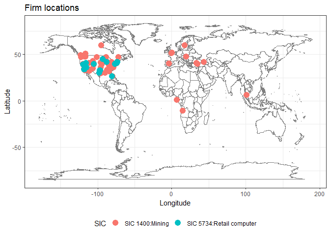
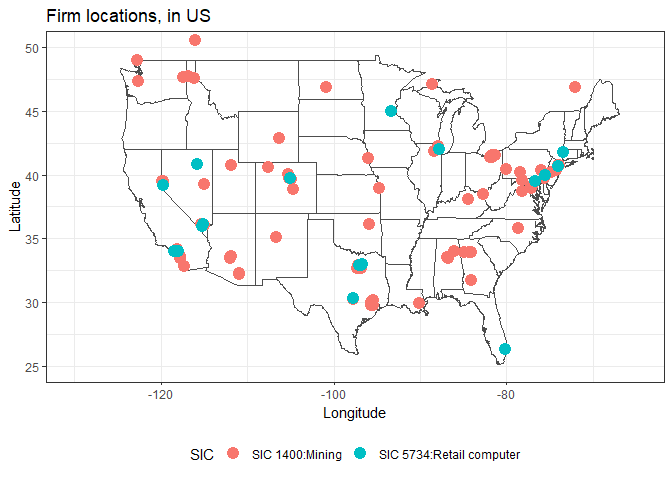

*DISCLAIMER: Do not exploit the instruction below to hammer the SEC website; MIT license applies.*

Cross-industry firm location differences using SEC website
==========================================================

The following procedure aims to

-   scrape the mailing addresses of firms listed in the [SEC website](https://www.sec.gov/edgar/searchedgar/companysearch.html) using `rvest`
-   retrieve physical locations from the mailing addresses using `ggmap`
-   plot the locations on a map using `ggmap` and `ggplot2`

The scraping is down recursively by extracting the firm's identifier through the search page(SIK) and create a url linked to the firm's web page indexed by the firm's identifier.

``` r
for (pkg in c("rvest","httr","dplyr","stringr","XML","RCurl","ggplot2","reshape","tm","ggmap")){
 if (!pkg %in% rownames(installed.packages())){install.packages(pkg)}
}
library(rvest)
library(dplyr)
library(stringr)
library(ggmap)
library(XML)
library(httr)
library(tm)
```

Retrieving firm addresses from SEC website
------------------------------------------

The SIC code for industries are available for lookup: [SIC code lookup](https://www.sec.gov/info/edgar/siccodes.htm)

We analyze the following industries:

-   1400: MINING & QUARRYING OF NONMETALLIC MINERALS (NO FUELS)
-   5734: RETAIL-COMPUTER & COMPUTER SOFTWARE STORES

``` r
SIC.CODES <- c(1400, 5734)
SIC.NAMES <- c("SIC 1400:Mining","SIC 5734:Retail computer")
```

Define a function that searches all firms in a given industry from the SEC website:

``` r
MAX.PAGE <- 5 # maximum number of pages to be read (each page contains 100 firms)

ConstructFirmDF <- function(sic) {
  i <- 0
  continue_indic = TRUE #always continue to search
  firm.df <- data.frame(firm_code=character(),compnay=character(),state=character())
  # Create an empty data frame to store information, The data frame contains three columns:
    # firm_code: stores the CIK
    # company  : company name
    # state    : the state of operation
  while (continue_indic){
    search_url <- paste('https://www.sec.gov/cgi-bin/browse-edgar?',
                      'action=getcompany&SIC=',sic,
                      '&owner=exclude&match=&start=',i*100,'&count=100&hidefilings=0',
                      sep="") #paste the sic code(for industry) into the search engine
  
    search_info <- GET(search_url) #fetch the html file
    parsed_search <- htmlParse(search_info) #use html Parser
    info <- try( data.frame(readHTMLTable(parsed_search)),TRUE) 
    # If the page has an empty table, it means we reach the end of the search
    # The info will contain a string fetched from the HTML file
    i <- i+1 #Search for next 100 records
    if (typeof(info) != "list"|| (i > MAX.PAGE)||dim(info)[1] == 0 ) {
      break #If the info returns text, stop searching
    }
    names(info) <- c("firm_code","company","state") #Rename the list to match the column names
    firm.df <- rbind(firm.df,info) #Merge the search results with the large data frame
  }
  
  return (firm.df)
}#End of ConstructFirmDF


firm.df.1 <- ConstructFirmDF(SIC.CODES[1]) #Search for 100 records for firm 1
```

    ## No encoding supplied: defaulting to UTF-8.
    ## No encoding supplied: defaulting to UTF-8.
    ## No encoding supplied: defaulting to UTF-8.
    ## No encoding supplied: defaulting to UTF-8.

``` r
firm.df.2 <- ConstructFirmDF(SIC.CODES[2]) #Searcg for 100 records for firm 2
```

    ## No encoding supplied: defaulting to UTF-8.
    ## No encoding supplied: defaulting to UTF-8.

``` r
print(head(firm.df.1))
```

    ##    firm_code                         company state
    ## 1 0001084477               ADAMSON RICHARD G    NC
    ## 2 0001164704          ALBERTA EXPLORATION CO    A0
    ## 3 0001238176   ALBERTA STAR DEVELOPMENT CORP    A1
    ## 4 0000813621        AMCOL INTERNATIONAL CORP    IL
    ## 5 0001062493     AMERICAN BENEFITS GROUP INC    FL
    ## 6 0000225255 AMERICAN RESOURCES GROUP INC/CO    CO

``` r
print(head(firm.df.2))
```

    ##    firm_code                     company state
    ## 1 0000833443                BABBAGES INC    TX
    ## 2 0001537689         Comp Services, Inc.    CA
    ## 3 0001084954               COMPGEEKS INC    CA
    ## 4 0000880323                 COMPUSA INC    TX
    ## 5 0001103833 Crown Equity Holdings, Inc.    NV
    ## 6 0001041712        CYBERIAN OUTPOST INC    CT

For each individual firm, find the location in the firm's home page.

``` r
GetLocation <- function(firm_code){
  url <- paste('https://www.sec.gov/cgi-bin/browse-edgar?action=getcompany&CIK=',
               firm_code,'&owner=include&count=40&hidefilings=0',sep = "")
  firm_page <- read_html(url)
  addr_str <- firm_page %>% html_nodes(".mailer") %>% html_text() 
  mail_addr <- addr_str[1] %>% strsplit("\n") 
  mail_addr <- mail_addr[[1]][-1] %>% str_trim() %>% str_c(collapse = "\n")
  
  # The first element is buisness address, the second is the mailing address
  return(mail_addr)
}

firm.df.1$address <- sapply(firm.df.1$firm_code, GetLocation)
firm.df.2$address <- sapply(firm.df.2$firm_code, GetLocation)

print(head(firm.df.1))
```

    ##    firm_code                         company state
    ## 1 0001084477               ADAMSON RICHARD G    NC
    ## 2 0001164704          ALBERTA EXPLORATION CO    A0
    ## 3 0001238176   ALBERTA STAR DEVELOPMENT CORP    A1
    ## 4 0000813621        AMCOL INTERNATIONAL CORP    IL
    ## 5 0001062493     AMERICAN BENEFITS GROUP INC    FL
    ## 6 0000225255 AMERICAN RESOURCES GROUP INC/CO    CO
    ##                                                                  address
    ## 1 MARTIN MARIETTA MATERIALS INC\n2710 WYCLIFF ROAD\n\nRALEIGH NC 27607\n
    ## 2            15 APPLEBROOK CIRCLE SE\n\nCALGARY ALBERTA CANA A0 T2A7S5\n
    ## 3            675 WEST HASTING STE 200\n\nVANCOUVER BC CANADA A1 V6B1N2\n
    ## 4                        2870 FORBS AVENUE\n\nHOFFMAN ESTATES IL 60192\n
    ## 5                 10 FAIRWAY DR\nSUITE 307\n\nDEERFIELD BEACH FL 33441\n
    ## 6

``` r
print(head(firm.df.2))
```

    ##    firm_code                     company state
    ## 1 0000833443                BABBAGES INC    TX
    ## 2 0001537689         Comp Services, Inc.    CA
    ## 3 0001084954               COMPGEEKS INC    CA
    ## 4 0000880323                 COMPUSA INC    TX
    ## 5 0001103833 Crown Equity Holdings, Inc.    NV
    ## 6 0001041712        CYBERIAN OUTPOST INC    CT
    ##                                            address
    ## 1       10741 KING WILLIAM DR\n\nDALLAS TX 75220\n
    ## 2    1100 PEDRAS ROAD\n#B122\n\nTURLOCK CA 95382\n
    ## 3                                                 
    ## 4     14951 NORTH DALLAS PKWY\n\nDALLAS TX 75240\n
    ## 5 11226 PENTLAND DOWNS ST.\n\nLAS VEGAS NV 89146\n
    ## 6 27 NORTH MAIN ST\nP O BOX 636\n\nKENT CT 06757\n

Retrieving physical locations from addresses
--------------------------------------------

It turns out that company addresses are not sufficient for plotting -- we need geographical locations in terms of latitude and longitude as well. One good news is that `ggmap` can handle this; there is no need of Googling all firm locations manually.

Construct the following function that returns the geolocation of `address`:

``` r
GetGeocode <- function (address) {
  geocode(address, source = "dsk") # extract geocode using Data Science Toolkit
}
```

For instance, the geocode of company `BOREALIS TECHNOLOGY CORP` from `https://www.sec.gov/cgi-bin/browse-edgar?action=getcompany&CIK=0001014767&owner=include&count=40&hidefilings=0` can be found by passing their business address:

``` r
address <- "4070 SILVER SAGE DR\nSTE 211\nCARSON CITY NV 89701" # demo address
GetGeocode(address) # lon/lat of the demo address
```

    ## Information from URL : http://www.datasciencetoolkit.org/maps/api/geocode/json?address=4070%20SILVER%20SAGE%20DR%0ASTE%20211%0ACARSON%20CITY%20NV%2089701&sensor=false

    ##         lon      lat
    ## 1 -119.7636 39.13062

where `lon` and `lat` indicate its longitude and latitude respectively.

### Multiple locations

Getting multiple locations can be done by using `lapply` function:

``` r
firm.df.1.locations <- lapply(firm.df.1$address, GetGeocode) #Get all the longtitude and latitude 
firm.df.2.locations <- lapply(firm.df.2$address, GetGeocode)
print(head(firm.df.1.locations))
```

    ## [[1]]
    ##         lon      lat
    ## 1 -78.69467 35.81571
    ## 
    ## [[2]]
    ##       lon     lat
    ## 1 35.0724 39.8049
    ## 
    ## [[3]]
    ##   lon lat
    ## 1  NA  NA
    ## 
    ## [[4]]
    ##         lon      lat
    ## 1 -88.38199 41.86861
    ## 
    ## [[5]]
    ##         lon      lat
    ## 1 -80.11057 26.31859
    ## 
    ## [[6]]
    ##   lon lat
    ## 1  NA  NA

Note that some locations might not have been fetched due to errors (some addresses might not exist anymore). `lapply` performs broadcasting a given function (second parameter) to a vector (first parameter) and returns a list, which is why it is called *l*`apply`.

To extract longitudes and latitudes, one can call the followings.

``` r
firm.df.1.lons <- sapply(firm.df.1.locations, "[[", "lon") # extract lon elements from a list of lists
firm.df.1.lats <- sapply(firm.df.1.locations, "[[", "lat") # extract lat elements from a list of lists
firm.df.2.lons <- sapply(firm.df.2.locations, "[[", "lon") # extract lon elements from a list of lists
firm.df.2.lats <- sapply(firm.df.2.locations, "[[", "lat") # extract lat elements from a list of lists
location.df.1 <- data.frame(lon = firm.df.1.lons, lat = firm.df.1.lats)
location.df.2 <- data.frame(lon = firm.df.2.lons, lat = firm.df.2.lats)
print(head(location.df.1))
```

    ##         lon      lat
    ## 1 -78.69467 35.81571
    ## 2  35.07240 39.80490
    ## 3        NA       NA
    ## 4 -88.38199 41.86861
    ## 5 -80.11057 26.31859
    ## 6        NA       NA

Plotting locations
------------------

First, construct a combined `data.frame` for plot:

``` r
location.df.1$SIC <- SIC.NAMES[1]
location.df.2$SIC <- SIC.NAMES[2]

location.df <- rbind(location.df.1, location.df.2) %>%
  na.omit() # remove rows whose firm locations are not found
print(head(location.df))
```

    ##          lon      lat             SIC
    ## 1  -78.69467 35.81571 SIC 1400:Mining
    ## 2   35.07240 39.80490 SIC 1400:Mining
    ## 4  -88.38199 41.86861 SIC 1400:Mining
    ## 5  -80.11057 26.31859 SIC 1400:Mining
    ## 8 -106.33532 42.84894 SIC 1400:Mining
    ## 9 -116.00190 50.54020 SIC 1400:Mining

Plot on the world map:

``` r
ggplot(location.df, aes(x=lon, y=lat, color=SIC)) + 
  borders("world", colour="gray50", fill="white") +
  geom_point(size=4) +
  labs(x = "Longitude", y = "Latitude", title = "Firm locations") +
  theme_bw() +
    theme(legend.position="bottom")
```



And plot on the US map:

``` r
ggplot(location.df, aes(x=lon, y=lat, color=SIC)) + 
  geom_map(data=map_data("state"), map=map_data("state"), # draw borders based on USA.MAP
          aes(long, lat, map_id=region),
          color="gray30", fill=NA) +
  coord_cartesian(xlim = c(-130, -65), ylim = c(25, 50)) + # lat/long on lin US 
  geom_point(size=4) +
  labs(x = "Longitude", y = "Latitude", title = "Firm locations, in US") +
  theme_bw() +
    theme(legend.position="bottom")
```


