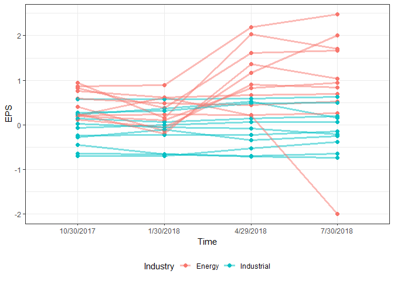

``` r
ticker_list <- c("LULU")
yahoo_url <- "https://finance.yahoo.com/quote/LULU/analysis?p=LULU&.tsrc=fin-srch"
url_file <- GET(yahoo_url)
web_page_parsed <- htmlParse(url_file, encoding = "UTF-8")
tables <- readHTMLTable(web_page_parsed)
print(head(tables))
```

    ## $`NULL`
    ##   Earnings Estimate Current Qtr. (Oct 2018) Next Qtr. (Jan 2019)
    ## 1   No. of Analysts                      34                   33
    ## 2     Avg. Estimate                    0.69                 1.64
    ## 3      Low Estimate                    0.67                 1.56
    ## 4     High Estimate                    0.75                 1.76
    ## 5      Year Ago EPS                    0.56                 1.33
    ##   Current Year (2019) Next Year (2020)
    ## 1                  37               37
    ## 2                3.59             4.24
    ## 3                 3.5             3.86
    ## 4                 3.8              4.7
    ## 5                2.59             3.59
    ## 
    ## $`NULL`
    ##          Revenue Estimate Current Qtr. (Oct 2018) Next Qtr. (Jan 2019)
    ## 1         No. of Analysts                      31                   30
    ## 2           Avg. Estimate                 735.87M                1.12B
    ## 3            Low Estimate                  724.1M                1.09B
    ## 4           High Estimate                  766.1M                 1.2B
    ## 5          Year Ago Sales                 619.02M               928.8M
    ## 6 Sales Growth (year/est)                  18.90%               20.80%
    ##   Current Year (2019) Next Year (2020)
    ## 1                  35               35
    ## 2               3.23B            3.66B
    ## 3               3.19B            3.49B
    ## 4               3.32B             3.8B
    ## 5               2.65B            3.23B
    ## 6              21.90%           13.40%
    ## 
    ## $`NULL`
    ##   Earnings History 10/30/2017 1/30/2018 4/29/2018 7/30/2018
    ## 1         EPS Est.       0.52      1.27      0.46      0.49
    ## 2       EPS Actual       0.56      1.33      0.55      0.71
    ## 3       Difference       0.04      0.06      0.09      0.22
    ## 4       Surprise %      7.70%     4.70%    19.60%    44.90%
    ## 
    ## $`NULL`
    ##          EPS Trend Current Qtr. (Oct 2018) Next Qtr. (Jan 2019)
    ## 1 Current Estimate                    0.69                 1.64
    ## 2       7 Days Ago                    0.69                 1.64
    ## 3      30 Days Ago                    0.69                 1.64
    ## 4      60 Days Ago                    0.68                 1.64
    ## 5      90 Days Ago                    0.63                 1.56
    ##   Current Year (2019) Next Year (2020)
    ## 1                3.59             4.24
    ## 2                3.59             4.24
    ## 3                3.59             4.22
    ## 4                3.58             4.19
    ## 5                3.23             3.74
    ## 
    ## $`NULL`
    ##       EPS Revisions Current Qtr. (Oct 2018) Next Qtr. (Jan 2019)
    ## 1    Up Last 7 Days                       1                    1
    ## 2   Up Last 30 Days                       3                    3
    ## 3  Down Last 7 Days                     N/A                  N/A
    ## 4 Down Last 30 Days                     N/A                  N/A
    ##   Current Year (2019) Next Year (2020)
    ## 1                   1                1
    ## 2                   4                4
    ## 3                 N/A              N/A
    ## 4                 N/A              N/A
    ## 
    ## $`NULL`
    ##           Growth Estimates   LULU Industry Sector S&P 500
    ## 1             Current Qtr. 23.20%      N/A    N/A    0.48
    ## 2                Next Qtr. 23.30%      N/A    N/A    0.40
    ## 3             Current Year 38.60%      N/A    N/A    0.21
    ## 4                Next Year 18.10%      N/A    N/A    0.10
    ## 5 Next 5 Years (per annum) 24.06%      N/A    N/A    0.11
    ## 6 Past 5 Years (per annum)  9.54%      N/A    N/A     N/A

Data frame with Ticker, ind, quarter, value

<http://markets.money.cnn.com/Marketsdata/Sectors>

``` r
industrial_list <- c("AROC","BHGE","BAS","BRS","CJ","WHD","CRR","CLB","CCLP","DWSN","DRQ") 
energy_list <- c("ANDX","CVI","CVRR","DK","ENBL","HFC","MPC","NS","PBF","PBFX","PSX")

get_table <- function(ticker_list){
  industry_trend <- data.frame()
  for (ticker in ticker_list){
    yahoo_url <- paste("https://finance.yahoo.com/quote/",ticker,"/analysis?p=",
                       ticker,"&.tsrc=fin-srch",sep="")
    web_page_parsed <- htmlParse(GET(yahoo_url), encoding = "UTF-8")
    tables <- readHTMLTable(web_page_parsed)
    EPS_trend <- tables[[3]][1,-1]
    EPS_trend$Ticker <- ticker
    # names(EPS_trend)  <-  c("Current Qtr.","Next Qtr.","Current Year"," Next Year","Ticker")
    names(EPS_trend)  <-  c("10/30/2017","1/30/2018","4/29/2018","7/30/2018","Ticker")
    industry_trend <- rbind(industry_trend,EPS_trend)
  }
  return(industry_trend)
}
```

``` r
industrial_trend <- get_table(industrial_list)
energy_trend <- get_table(energy_list)
print(industrial_trend)
```

    ##    10/30/2017 1/30/2018 4/29/2018 7/30/2018 Ticker
    ## 1       -0.07         0      0.06      0.07   AROC
    ## 2        0.14      0.06      0.14       0.2   BHGE
    ## 3       -0.45     -0.66     -0.71     -0.74    BAS
    ## 4       -0.65     -0.66     -0.69     -0.64    BRS
    ## 5        0.24      0.37      0.52      0.16     CJ
    ## 6        0.28      0.32      0.49       0.5    WHD
    ## 7        -0.7     -0.69     -0.53     -0.38    CRR
    ## 8        0.58      0.57      0.59      0.63    CLB
    ## 9       -0.24     -0.22     -0.22     -0.14   CCLP
    ## 10      -0.27      -0.1     -0.34     -0.25   DWSN
    ## 11       0.02     -0.05     -0.08     -0.21    DRQ

``` r
print(energy_trend)
```

    ##    10/30/2017 1/30/2018 4/29/2018 7/30/2018 Ticker
    ## 1        0.76      0.62      0.67      0.69   ANDX
    ## 2        0.12     -0.05      0.91      0.84    CVI
    ## 3         0.2       0.1      0.82      0.94   CVRR
    ## 4         0.4     -0.13      1.17         2     DK
    ## 5        0.21      0.23      0.22      0.26   ENBL
    ## 6        0.83      0.38      1.61      1.67    HFC
    ## 7        0.95      0.16      2.03       1.7    MPC
    ## 8        0.21      0.61      0.21     -1.99     NS
    ## 9        0.25      -0.2      1.36      1.03    PBF
    ## 10       0.59      0.49      0.45      0.53   PBFX
    ## 11       0.86      0.89      2.19      2.48    PSX

``` r
library(reshape)
```

    ## Warning: package 'reshape' was built under R version 3.5.1

    ## 
    ## Attaching package: 'reshape'

    ## The following object is masked from 'package:dplyr':
    ## 
    ##     rename

``` r
industrial_trend_melt <- melt(industrial_trend,c("Ticker")) 
industrial_trend_melt$Industry <- "Industrial"
energy_trend_melt <- melt(energy_trend,c("Ticker")) 
energy_trend_melt$Industry <- "Energy"

stock_trend <- rbind(energy_trend_melt,industrial_trend_melt)
names(stock_trend) <- c("Ticker","Time","EPS","Industry")
print(head(stock_trend))
```

    ##   Ticker       Time  EPS Industry
    ## 1   ANDX 10/30/2017 0.76   Energy
    ## 2    CVI 10/30/2017 0.12   Energy
    ## 3   CVRR 10/30/2017  0.2   Energy
    ## 4     DK 10/30/2017  0.4   Energy
    ## 5   ENBL 10/30/2017 0.21   Energy
    ## 6    HFC 10/30/2017 0.83   Energy

Drawing plots
-------------

First, note that `EPS` is saved as a factor by `reshape` -- to convert the values back in numerics, *unfactoring* is needed (see <https://stackoverflow.com/questions/3418128/how-to-convert-a-factor-to-integer-numeric-without-loss-of-information>):

``` r
stock_trend$EPS <- as.numeric(levels(stock_trend$EPS))[stock_trend$EPS]
```

    ## Warning: NAs introduced by coercion

Let's draw a plot!

``` r
library(ggplot2)
```

    ## Warning: package 'ggplot2' was built under R version 3.5.1

``` r
ggplot2::ggplot(stock_trend, aes(x = Time, y = EPS, 
                                  group = Ticker, color = Industry)) +
  geom_point(size = 2) +
  geom_line(size = 1.2, alpha = 0.5) +
  theme_bw() +
  theme(legend.position="bottom")
```


