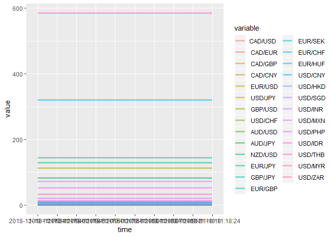

This example uses preliminary R packages without advanced function. The main goal is to parse an html web page and extract tables from the web page. \#\# Preload packages This script requires httr, XML, stringr. We are using GET function from httr httr: <https://cran.r-project.org/web/packages/httr/httr.pdf>

For parsing the XML, we use the htmlParse,readHTMLTable from XML <https://cran.r-project.org/web/packages/XML/XML.pdf>

The stringr package is used for parsing the strings. <http://edrub.in/CheatSheets/cheatSheetStringr.pdf>

dplyr cheat sheet: <https://www.rstudio.com/wp-content/uploads/2015/02/data-wrangling-cheatsheet.pdf>

``` r
for (pkg in c("rvest","httr","dplyr","stringr","XML","RCurl","ggplot2","reshape")){
 if (!pkg %in% rownames(installed.packages())){install.packages(pkg)}
}
library(rvest)
```

    ## Loading required package: xml2

``` r
library(httr)
library(dplyr)
```

    ## 
    ## Attaching package: 'dplyr'

    ## The following objects are masked from 'package:stats':
    ## 
    ##     filter, lag

    ## The following objects are masked from 'package:base':
    ## 
    ##     intersect, setdiff, setequal, union

``` r
library(stringr)
library(XML)
```

    ## 
    ## Attaching package: 'XML'

    ## The following object is masked from 'package:rvest':
    ## 
    ##     xml

``` r
library(RCurl)
```

    ## Loading required package: bitops

Realtime data collecting
------------------------

This section collect realtime data from yahoo finance currency page. Other pages are also available for data collect. Examples are listed below.

``` r
url_crypto <-"https://ca.finance.yahoo.com/cryptocurrencies"
url_commo <- "https://ca.finance.yahoo.com/commodities"
url_curr <- "https://ca.finance.yahoo.com/currencies"
i = 0 
currency_price <- data.frame()
time_list <- c()
while (i < 10){
  web_page_parsed <- htmlParse(GET(url_curr), encoding = "UTF-8") #Parse the HTML
  table <- readHTMLTable(web_page_parsed) #Extract table from HTML
  table <- table[[1]][,1:3] #Only keep the 3rd table, digit part
  names(table) <- c("Symb","Name","price") #Change dataframe name for easy merge
  price_list <-as.numeric(strsplit(toString(table$price),",")[[1]])[1:28] #Process the data type, for all 28 FX price
  name_list <- strsplit(toString(table$Name),",")[[1]][1:28] #Get the name of the FX
  currency_price <- rbind(currency_price,price_list) #Merge the fetched data into the metadata
  colnames(currency_price) <- name_list #Rename the columns of the metadata
  time_list <- c(time_list,toString(Sys.time())) #Append the time to time_list
  Sys.sleep(5) #Sleep for 5 secs
  i = i + 1
}
currency_price$time <- time_list
print(head(currency_price))
```

    ##   CAD/USD  CAD/EUR  CAD/GBP  CAD/CNY  EUR/USD  USD/JPY  GBP/USD  USD/CHF
    ## 1    0.76     0.66   0.5892   5.2614   1.1457  112.500  1.28566  0.99306
    ## 2    0.76     0.66   0.5892   5.2614   1.1457  112.500  1.28566  0.99306
    ## 3    0.76     0.66   0.5892   5.2614   1.1457  112.499  1.28566  0.99305
    ## 4    0.76     0.66   0.5892   5.2614   1.1457  112.503  1.28566  0.99290
    ## 5    0.76     0.66   0.5892   5.2614   1.1457  112.503  1.28566  0.99301
    ## 6    0.76     0.66   0.5892   5.2614   1.1457  112.502  1.28566  0.99308
    ##    AUD/USD  AUD/JPY  NZD/USD  EUR/JPY  GBP/JPY  EUR/GBP  EUR/SEK  EUR/CHF
    ## 1   0.7292   82.036   0.6839  128.855  144.666  0.89062 10.31543  1.13749
    ## 2   0.7292   82.036   0.6839  128.855  144.666  0.89062 10.31543  1.13749
    ## 3   0.7292   82.045   0.6839  128.872  144.650  0.89057 10.31470  1.13749
    ## 4   0.7292   82.050   0.6839  128.872  144.690  0.89067 10.31405  1.13751
    ## 5   0.7292   82.052   0.6839  128.870  144.681  0.89066 10.31450  1.13761
    ## 6   0.7292   82.049   0.6839  128.868  144.680  0.89066 10.31480  1.13757
    ##    EUR/HUF  EUR/JPY  USD/CNY  USD/HKD  USD/SGD  USD/INR  USD/MXN  USD/PHP
    ## 1   321.15  128.855   6.9397  7.83226  1.37122    71.44  20.3701     52.5
    ## 2   321.15  128.855   6.9397  7.83226  1.37122    71.44  20.3701     52.5
    ## 3   321.15  128.872   6.9397  7.83220  1.37119    71.44  20.3667     52.5
    ## 4   321.15  128.872   6.9397  7.83219  1.37122    71.44  20.3635     52.5
    ## 5   321.15  128.870   6.9397  7.83219  1.37122    71.44  20.3669     52.5
    ## 6   321.15  128.868   6.9397  7.83219  1.37122    71.44  20.3680     52.5
    ##    USD/IDR  USD/THB  USD/MYR  USD/ZAR                time
    ## 1       14      585    32.91    4.187 2018-11-19 11:17:34
    ## 2       14      585    32.91    4.187 2018-11-19 11:17:40
    ## 3       14      585    32.91    4.187 2018-11-19 11:17:45
    ## 4       14      585    32.91    4.187 2018-11-19 11:17:50
    ## 5       14      585    32.91    4.187 2018-11-19 11:17:56
    ## 6       14      585    32.91    4.187 2018-11-19 11:18:01

Plot the Data from the last 10 seconds
--------------------------------------

Reshape <https://www.statmethods.net/management/reshape.html>

GGplot2 cheat sheet: <https://www.rstudio.com/wp-content/uploads/2015/03/ggplot2-cheatsheet.pdf>

``` r
library(ggplot2)
library(reshape)
```

    ## 
    ## Attaching package: 'reshape'

    ## The following object is masked from 'package:dplyr':
    ## 
    ##     rename

``` r
price_plot <- melt(currency_price,"time")
ggplot2::ggplot(price_plot,aes(x = time, 
                               y = value, 
                                  group = variable, color = variable)) + 
                                geom_line(size = 1.2, alpha = 0.5)   
```



Real time example
-----------------

These two examples use the same script. Instead we setting the Sys.sleep() to 60 seconds and collect 100 data points.

 
